# Purpose

The `Content-Security-Policy` (CSP) HTTP response header allows a website to define **which sources of content the browser is allowed to load or execute**. It is one of the most powerful browser-side security controls available and is primarily designed to **mitigate JavaScript (JS) injection attacks**.

Browsers normally load resources such as scripts, images, stylesheets, iframes, fonts, AJAX requests, and media from any origin the page references. If an attacker manages to inject HTML or JS into a vulnerable page, the browser will execute it unless additional protections exist. CSP changes this by enforcing a **strict allowlist model**: the server declares what sources are trusted (e.g., `'self'`, a specific CDN, or a nonce-based inline script), and **everything else is blocked by default**. With a well-designed CSP, even successful HTML injection does *not* lead to script execution, because the malicious inline `<script>` or `` fails CSP validation.

CSP effectively replaces several legacy security headers:
- The most important example is `X-Frame-Options`, which is deprecated and fully replaced by the CSP directive `frame-ancestors`, giving finer control over which origins may embed a page.
- The old `X-XSS-Protection` header is also deprecated (and disabled in Chrome/Edge) because CSP offers significantly stronger XSS protection through `script-src` restrictions, nonces, and blocking inline scripts. CSP can also take over the role of `<base>` restrictions and some URL sanitization patterns through `navigate-to`.

While not replacements in the strict sense, CSP directives like `object-src`, `media-src`, and `script-src` also deprecate the need for plugin-control headers like `X-Content-Security-Policy` (old IE) and reduce reliance on some legacy HTML-based mitigations.

| Legacy Header | Status | CSP Directive | Notes |
| --- | --- | --- | --- |
| `X-Frame-Options` | ❌ Deprecated | **`frame-ancestors`** | CSP replacement is more flexible: supports multiple origins, wildcards, and `'none'`. |
| `X-XSS-Protection` | ❌ Deprecated / ignored | **`script-src`**, nonces, hashes, `'unsafe-inline'` blocking | Modern browsers disable XXP entirely; CSP is the recommended XSS defense. |
| `X-Content-Security-Policy` (old Firefox/IE CSP draft) | ❌ Obsolete | CSP standard header | This was an old prototype; modern CSP fully replaces it. |

# Values

A CSP header is composed of **directives**, each controlling a different type of content:

| Directive | Meaning / use |
| --- | --- |
| `default-src 'self'` | Fallback policy for all resource types (if no more specific directive exists) |
| `script-src 'self'` | Allowed JavaScript sources; blocks inline JS unless using `nonce-...` or `sha256-...` |
| `style-src 'self' 'unsafe-inline'` | Allowed CSS sources; inline styles must be explicitly allowed |
| `img-src 'self' data:` | Allowed image sources; `data:` enables base64-embedded images |
| `connect-src 'self'` | Allowed destinations for XHR, `fetch()`, WebSocket, etc. |
| `frame-ancestors 'none'` | Controls which sites may embed this page (modern replacement for `X-Frame-Options`) |
| `object-src 'none'` | Disables Flash/Java applet/legacy plugins |

Useful keywords:

| Keyword | Meaning |
| --- | --- |
| `'self'` | Same origin only |
| `'none'` | Nothing allowed |
| `'unsafe-inline'` | Allows inline `<script>` or `onclick=` handlers |
| `'unsafe-eval'` | Allows `eval()` and similar mechanisms |
| `'nonce-<value>'` | Allows inline scripts with a server-generated nonce attribute |
| `'strict-dynamic'` | Allows dynamically inserted scripts *only if* they originate from trusted scripts |

A simple but effective CSP example:

```
Content-Security-Policy: default-src 'self'; script-src 'self'; object-src 'none';
```

This configuration blocks inline JavaScript, event handlers, remote scripts, plugin content, and most common XSS payloads.

# References

- [Content-Security-Policy (MDN)](https://developer.mozilla.org/en-US/docs/Web/HTTP/CSP)
- [CSP Cheat Sheet (OWASP)](https://cheatsheetseries.owasp.org/cheatsheets/Content_Security_Policy_Cheat_Sheet.html)
- [Google CSP Evaluator](https://csp-evaluator.withgoogle.com/)

# PoC

For this PoC we have created one server that dynamically applies different CSP headers depending on an environment variable (`CSP_MODE`). Each mode demonstrates a different use-case or attack scenario related to CSP. Below is the list with descriptions and what each mode shows:

| **Mode**            | **What It Demonstrates**                              | **CSP Used**                         | **Outcome**               |
| ------------------- | ----------------------------------------------------- | ------------------------------------ | ------------------------- |
| **no-csp**          | Baseline vulnerable mode                              | No CSP                               | Attacks work
| **reflected-xss**   | Reflected XSS                                         | `script-src 'self'`                  | Attack JS fails to run    |
| **dom-xss**         | DOM-based sink exploitation                           | `script-src 'self'`                  | Inline `<script>` blocked |
| **unsafe-inline**   | Why `'unsafe-inline'` is dangerous                    | `script-src 'self' 'unsafe-inline'`  | Attacker JS **executes**  |
| **script-nonce**    | Nonce-based script whitelisting                       | `script-src 'nonce-XYZ'`             | Only `nonce` scripts run  |
| **clickjacking**    | Iframe embedding                                      | `frame-ancestors 'none'`             | Page cannot be framed     |
| **xhr-restriction** | Restricting fetch/XHR destinations                    | `connect-src 'self' api.example.com` | Requests to others fail   |

## Reflected-XSS

- The server reflects untrusted input directly into the HTML/JS
- Reflected-XSS abuses the server, not the browser
- CSP’s `script-src 'self'` blocks inline JS, so it defends the attack

```bash
$ CSP_MODE=none node server.js

[CSP PoC] Running mode: none
[CSP PoC] No CSP header applied (CSP_MODE=none)

[CSP PoC] Server listening on http://localhost:3000
```

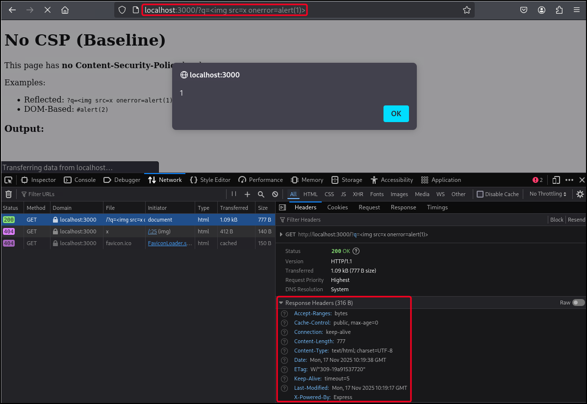

```bash
$ CSP_MODE=reflected-xss node server.js

[CSP PoC] Running mode: reflected-xss
[CSP PoC] Using CSP header:
script-src 'self'

[CSP PoC] Server listening on http://localhost:3000
```

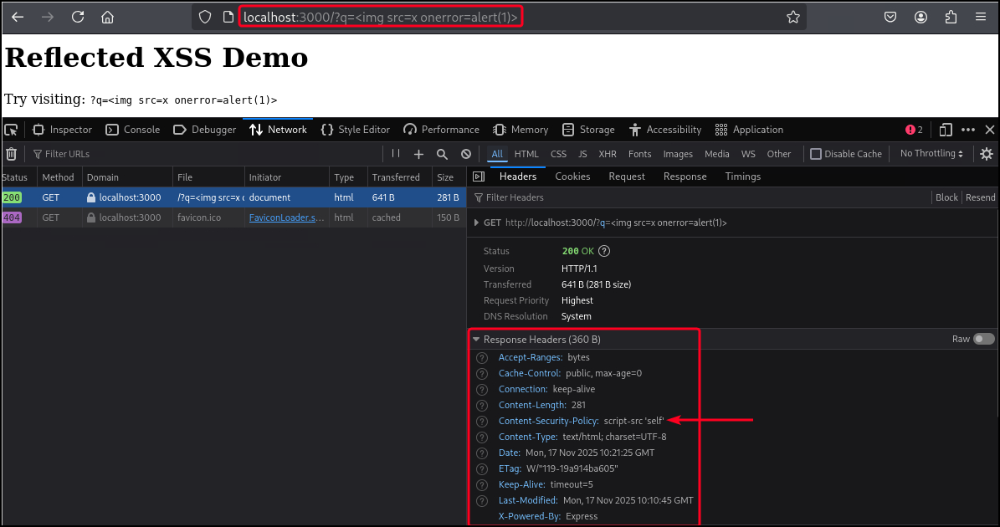

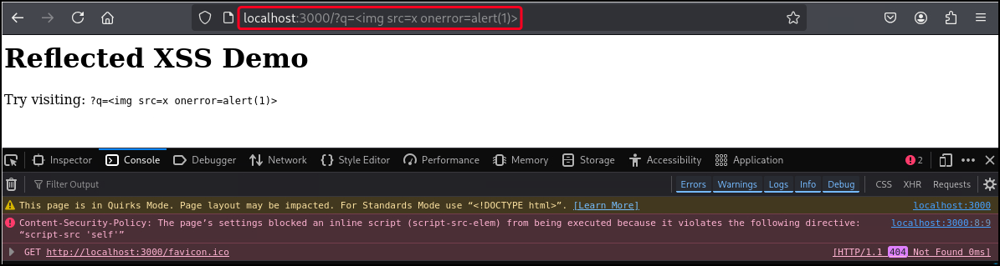

## Dom-XSS

- It happens inside JS in the browser, not in the server response (like reflected-XSS).
- The JS code in the browser uses unsafe sinks (e.g. `eval`)
- If the vulnerable sink is inside an inline script → CSP blocks it
- If the vulnerable sink is inside an external JS file → CSP cannot block it (DOM-xss)
- DOM-XSS abuses insecure client-side JS, not the server

```bash
$ CSP_MODE=none node server.js

[CSP PoC] Running mode: none
[CSP PoC] No CSP header applied (CSP_MODE=none)

[CSP PoC] Server listening on http://localhost:3000
```

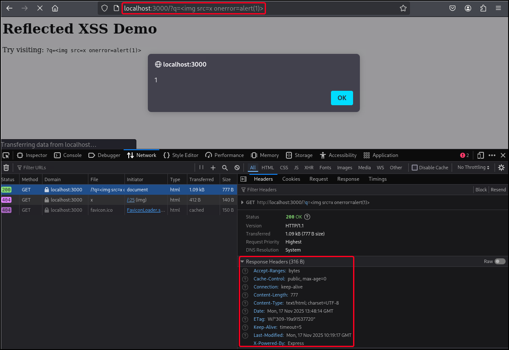

```bash
$ CSP_MODE=dom-xss node server.js

[CSP PoC] Running mode: dom-xss
[CSP PoC] Using CSP header:
script-src 'self'

[CSP PoC] Server listening on http://localhost:3000
```


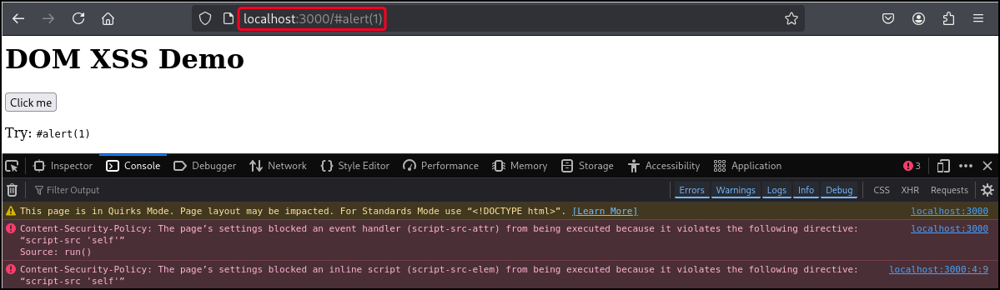

## Unsafe-Inline

```bash
$ CSP_MODE=unsafe-inline node server.js

[CSP PoC] Running mode: unsafe-inline
[CSP PoC] Using CSP header:
script-src 'self' 'unsafe-inline'

[CSP PoC] Server listening on http://localhost:3000
```

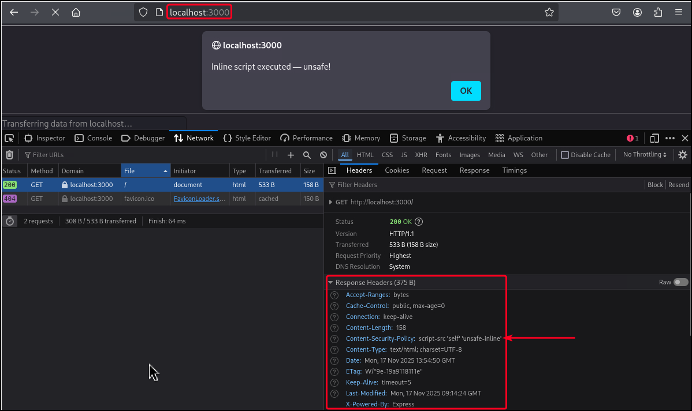

## Script-Nonce

```bash
$ CSP_MODE=script-nonce node server.js

[CSP PoC] Running mode: script-nonce
[CSP PoC] Using CSP header:
script-src 'nonce-random123'

[CSP PoC] Server listening on http://localhost:3000
```

Page includes a valid nonce script → runs.

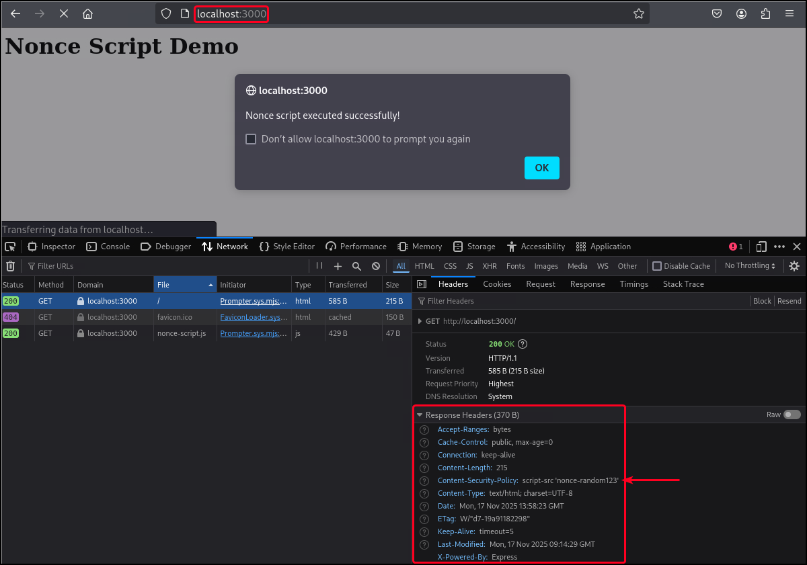

Attack attempts to inject an inline <script>alert(1)</script> → blocked.

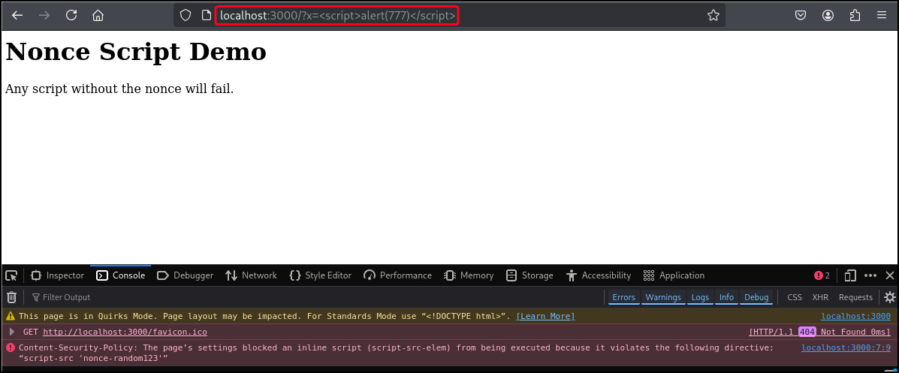

## Clickjacking

```bash
$ CSP_MODE=clickjacking node server.js

[CSP PoC] Mode: clickjacking
[CSP PoC] CSP Header:
frame-ancestors 'none'

[CSP PoC] HTTPS server: https://localhost:3443
```

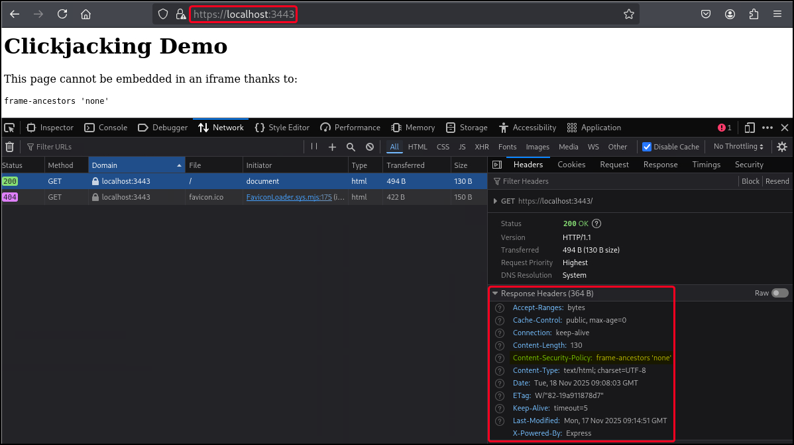

```bash
$ ls -l clickjacking-attacker.html
-rwxrwxrwx 1 x7331 x7331 154 Nov 18 09:09 clickjacking-attacker.html

$ python3 -m http.server 4000
Serving HTTP on 0.0.0.0 port 4000 (http://0.0.0.0:4000/) ...
```

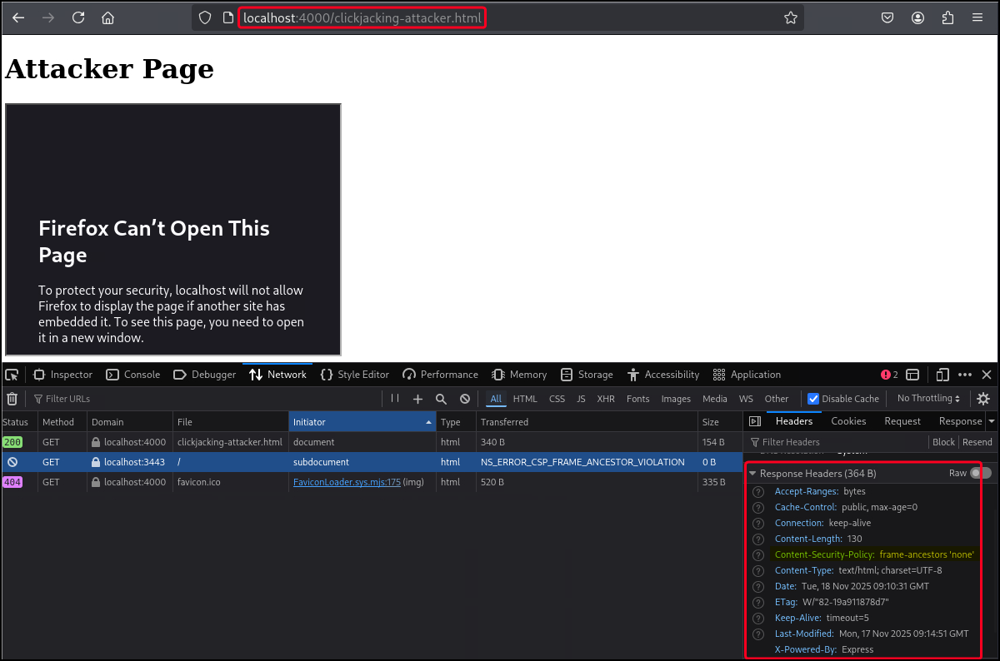

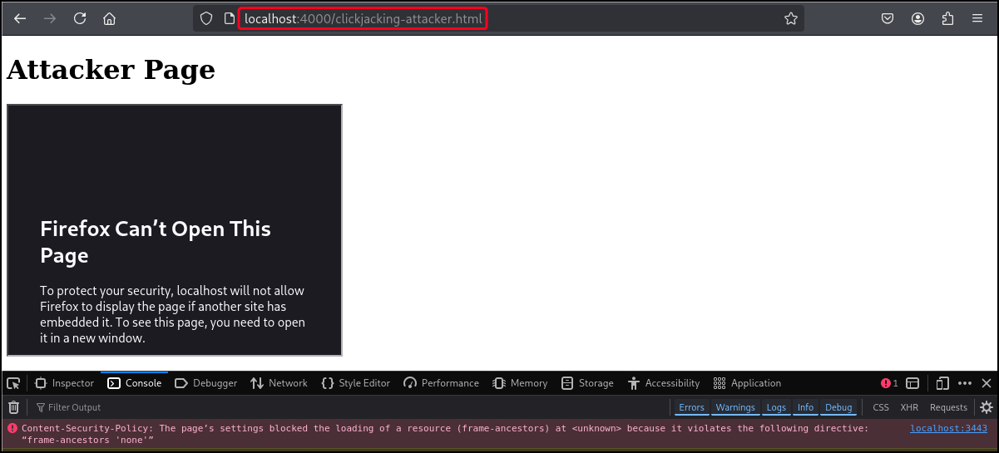

## XHR-Restriction

```bash
$ CSP_MODE=xhr-restriction node server.js

[CSP PoC] Mode: xhr-restriction
[CSP PoC] CSP Header:
connect-src 'self' https://allowed.example.com

[CSP PoC] HTTPS server: https://localhost:3443
```

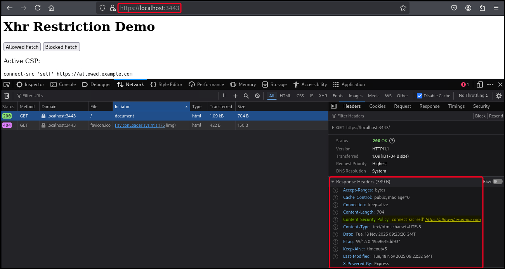

When we click *Allowed Fetch* the page tries to request `/api/data` which is a [localhost](http://localhost) URL and, thus, allowed to be fetched:

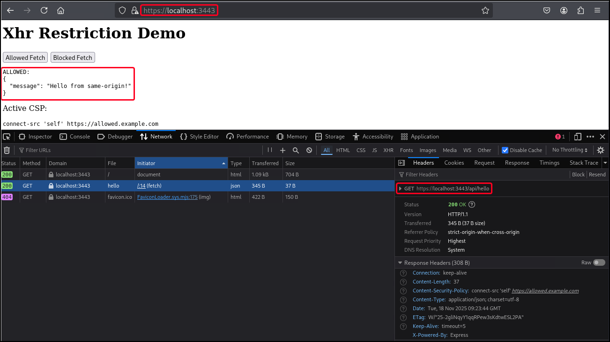

However, when we click *Blocked Fetch* the page tries to request `https://google.com`, which is not allowed based on the CSP and, therefore, is blocked:

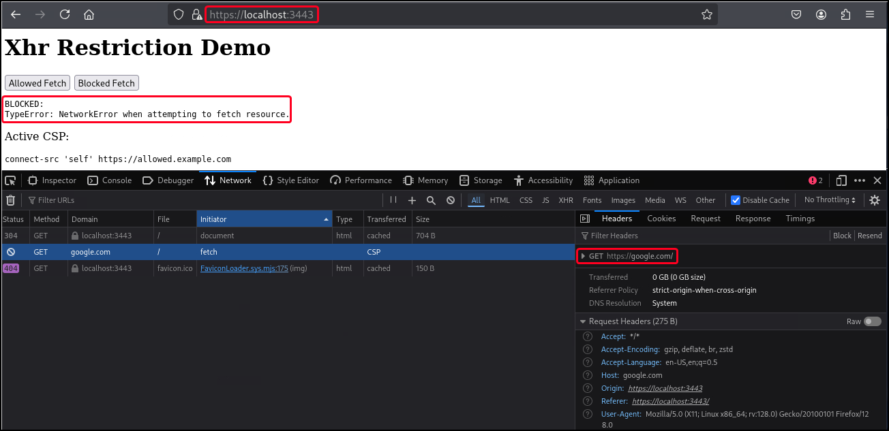

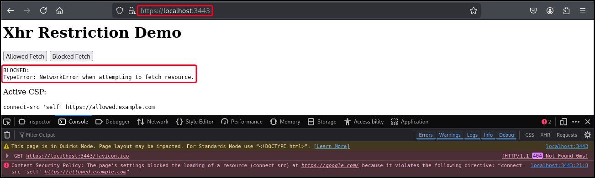