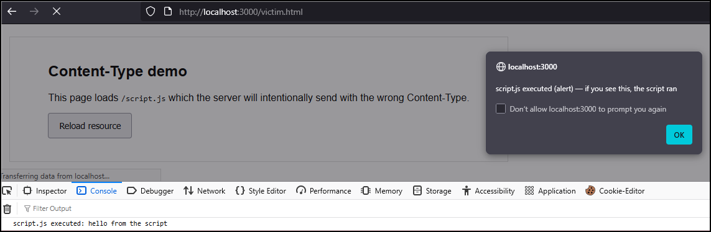
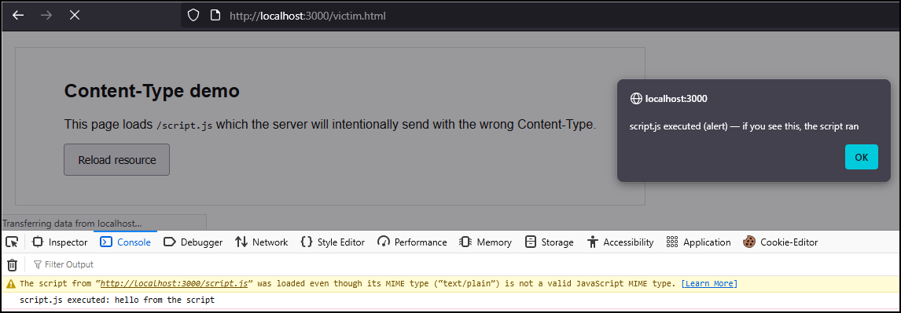
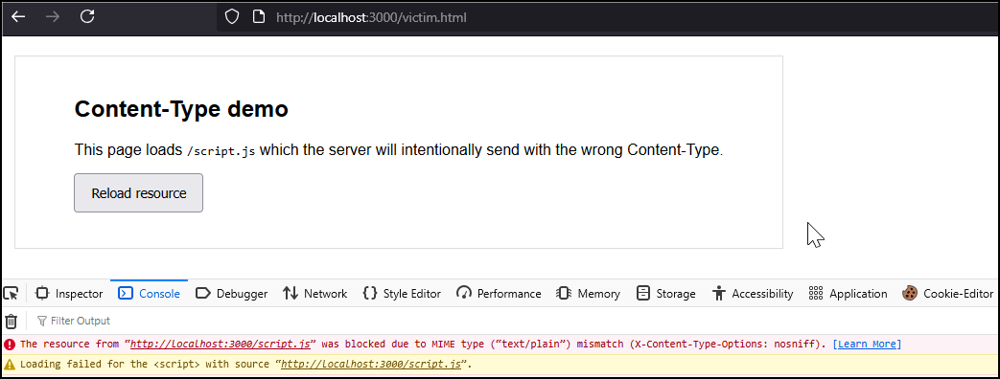

# Purpose

The `Content-Type` HTTP response header tells the browser the MIME type of the resource, for example `text/html`, `application/javascript`, `image/png`, etc. Browsers use this to decide how to process the resource — whether to parse it as HTML, execute it as JavaScript, render an image, etc. Sending the correct `Content-Type` is essential: an incorrect type can cause resources to be interpreted in the wrong context, leading to broken behavior or security issues, and in some cases combined with browser MIME-sniffing may allow execution of attacker-controlled content.

It should be noted that `Content-Type` (and `X-Content-Type-Options`) apply to the resource that the browser fetches, not the HTML page that references it. In the example PoC below, `victim.html` is an HTML document that contains `<script src="/script.js"></script>`. When the browser parses it, it issues a separate HTTP request for `/script.js`. The decision to execute this response as JS or not is made using the headers on the `/script.js` response.

# Values

| Header value | Meaning / use |
| --- | --- |
| `text/html; charset=utf-8` | HTML documents |
| `application/javascript; charset=utf-8` | JS files (scripts) |
| `text/css; charset=utf-8` | CSS stylesheets |
| `application/json; charset=utf-8` | JSON data |
| `image/png` / `image/jpeg` | Images |
| `text/plain; charset=utf-8` | Plain text |

# References

- [MDN Content-Type Header (MDN)](https://developer.mozilla.org/en-US/docs/Web/HTTP/Reference/Headers/Content-Type)
- [HTTP Security Response Headers Cheat Sheet (OWASP)](https://cheatsheetseries.owasp.org/cheatsheets/HTTP_Headers_Cheat_Sheet.html#content-type)
- [File Upload Cheat Sheet (OWASP)](https://cheatsheetseries.owasp.org/cheatsheets/File_Upload_Cheat_Sheet.html#content-type-validation)

# PoC

This PoC has a victim page to load `/script.js`. The server intentionally serves `/script.js` with the wrong `Content-Type` (`text/plain`). Depending on the browser and sniffing rules, you may or may not see the script execute; adding `X-Content-Type-Options: nosniff` will instruct modern browsers not to sniff and, thus, prevent the JS execution if the declared type is not a script type. Serve with correct `Content-Type`, confirm the header’s value, and load the page. The JS file should be executed:
    
```bash
$ MODE=correct node server.js
Server listening: http://localhost:3000/victim.html
MODE=correct  (use MODE=wrong|correct|wrong+nosniff)

$ curl -I http://localhost:3000/script.js
HTTP/1.1 200 OK
Content-Type: application/javascript; charset=utf-8
Date: Fri, 31 Oct 2025 16:54:58 GMT
Connection: keep-alive
Keep-Alive: timeout=5
```



Next, serve with the wrong `Content-Type`, confirm the header’s value, and reload the page. This time the browser will MIME-sniff the file’s content and execute the script regardless of the `Content-Type` value:
    
```bash
$ MODE=wrong node server.js
Server listening: http://localhost:3000/victim.html
MODE=wrong  (use MODE=wrong|correct|wrong+nosniff)

$ curl -I http://localhost:3000/script.js
HTTP/1.1 200 OK
Content-Type: text/plain; charset=utf-8
Date: Fri, 31 Oct 2025 16:53:21 GMT
Connection: keep-alive
Keep-Alive: timeout=5
```



Finally, serve with the wrong `Content-Type` as before plus the XTCO header, confirm that everything is there, and reload the page. This time the XTCO header should enforce `Content-Type`'s value and prevent the script from executing:

```bash
$ MODE=wrong+nosniff node server.js
Server listening: http://localhost:3000/victim.html
MODE=wrong+nosniff  (use MODE=wrong|correct|wrong+nosniff)

$ curl -I http://localhost:3000/script.js
HTTP/1.1 200 OK
Content-Type: text/plain; charset=utf-8
X-Content-Type-Options: nosniff
Date: Fri, 31 Oct 2025 16:50:21 GMT
Connection: keep-alive
Keep-Alive: timeout=5
```


