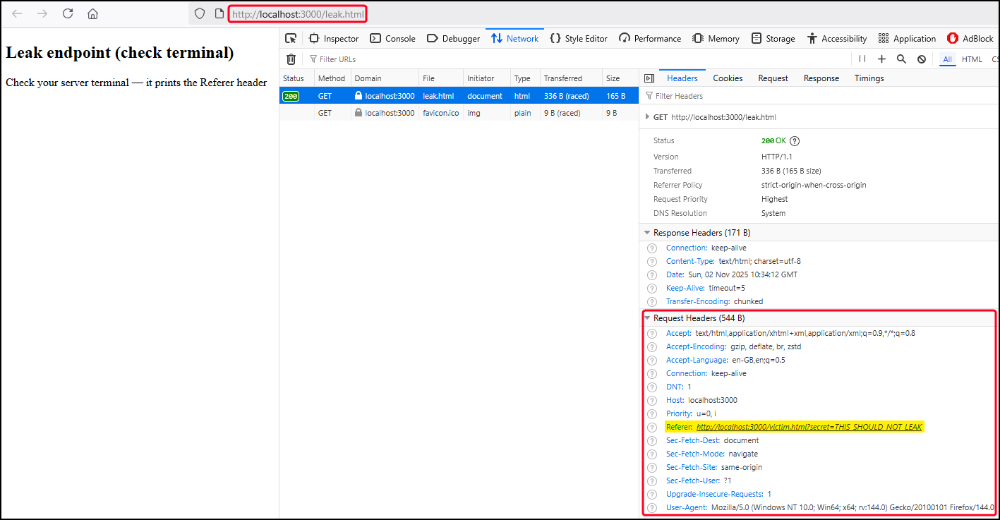
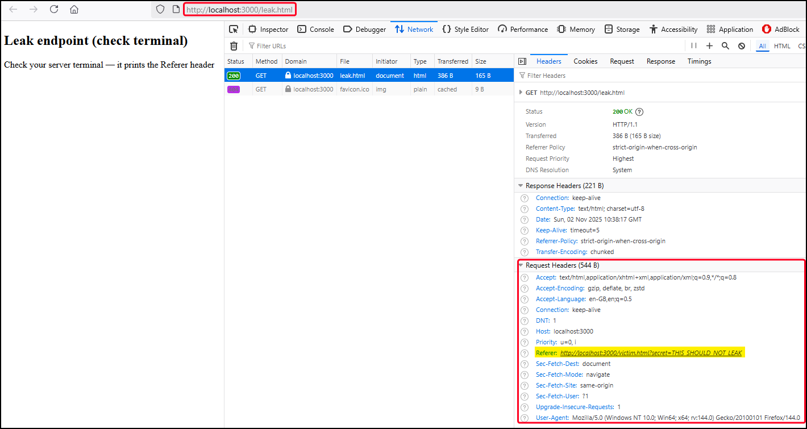
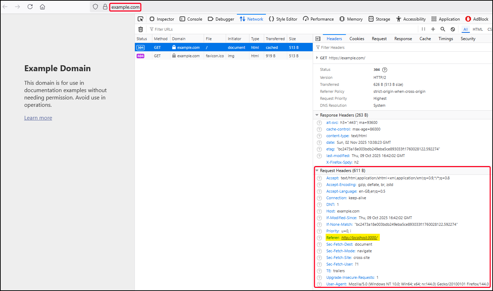
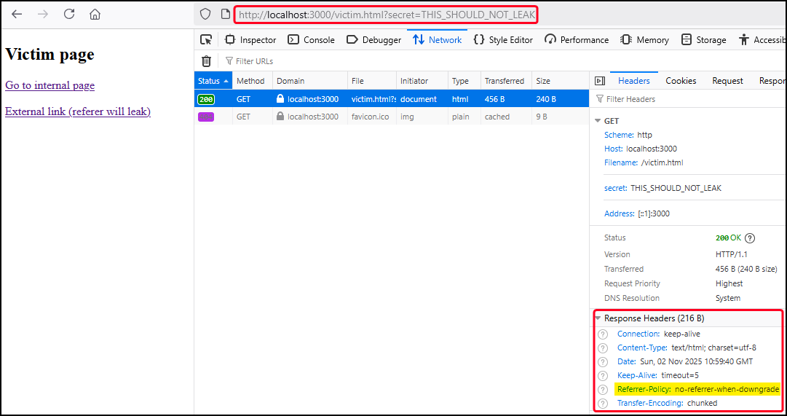
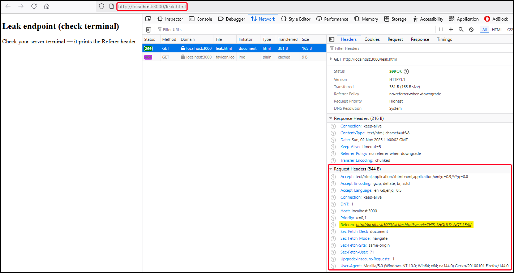
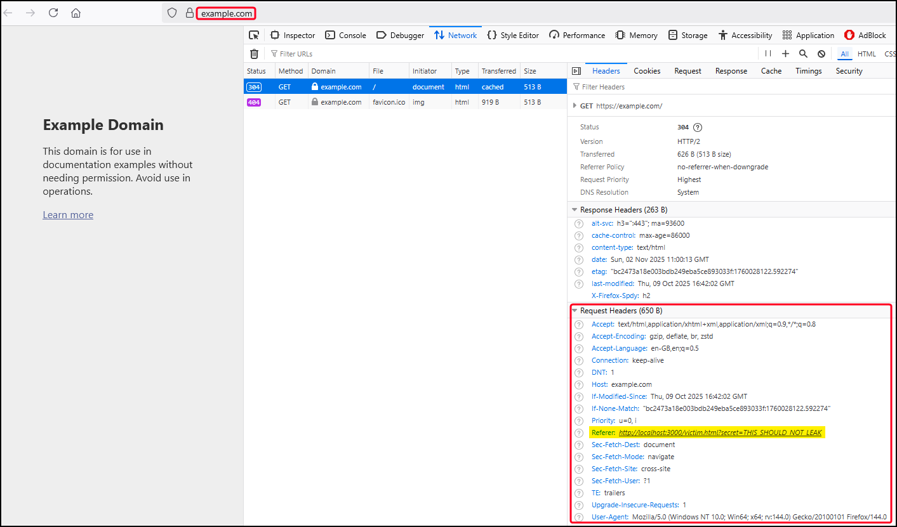
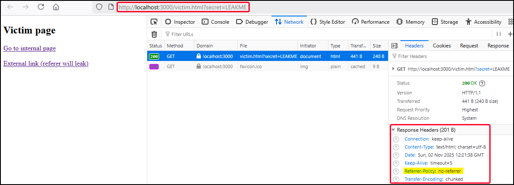
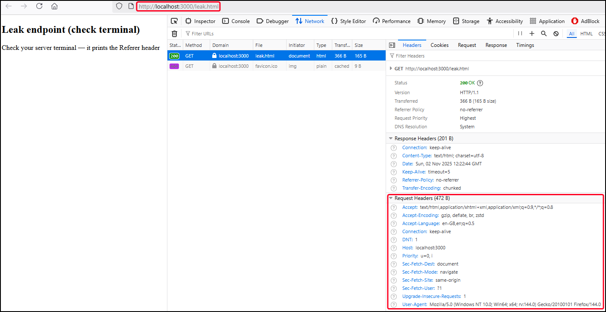
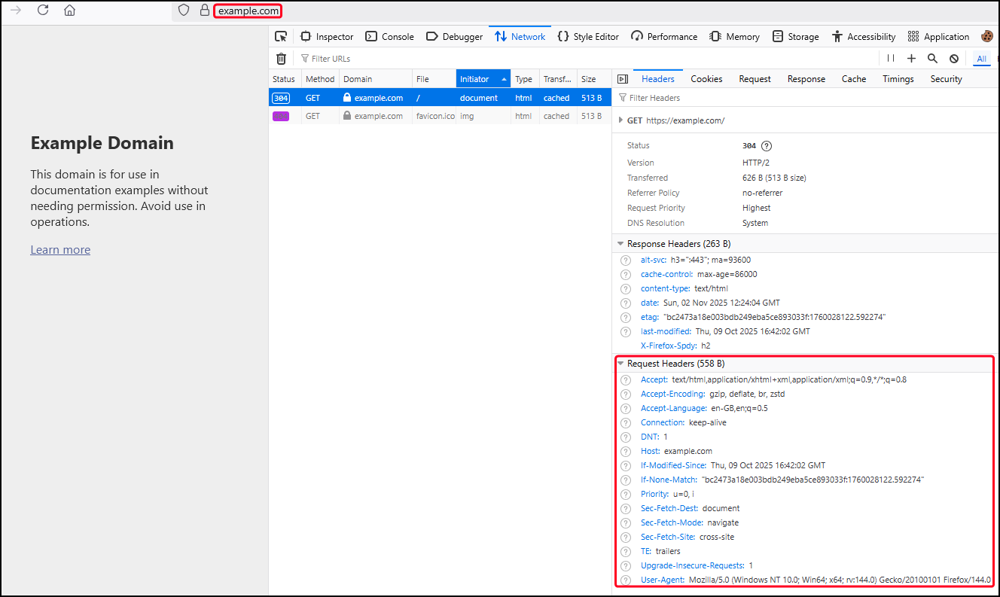

# Purpose

The `Referrer-Policy` header controls how much information the browser includes in the `Referer` HTTP header when navigating between pages (links, forms, images, scripts, redirects, etc.). Without a strict policy, URLs — including **query parameters that may contain sensitive data** — can be leaked to **third-party websites**. For example:

1. A user visits [https://example.com/account?token=abcd1234](https://example.com/account?token=abcd1234).
2. They then click a link to [https://attacker.com/collect](https://attacker.com/collect).
3. If `Referrer-Policy` is not set or too permissive, the browser will send `Referer: https://example.com/account?token=abcd1234`.

This leaks internal paths, user identifiers, search terms, or even session tokens depending on poor app design. A strict `Referrer-Policy` prevents this kind of data leakage.

# Values

| Value | Behavior |
| --- | --- |
| `no-referrer` | Sends **no** `Referer` header, ever. |
| `same-origin` | Sends full referrer **only** to same origin; strips completely on cross-origin. |
| `strict-origin` | Sends only the origin (`https://example.com`) to HTTPS sites, **no path/query**, and sends nothing to HTTP. |
| `strict-origin-when-cross-origin` (Recommended) | Sends full URL **for same-origin**, origin only for cross-origin (and nothing on HTTP downgrade). |
| `no-referrer-when-downgrade`  | Sends full URL except when going from HTTPS → HTTP. Not privacy-friendly. |

# References

- [Referrer-Policy (MDN)](https://developer.mozilla.org/en-US/docs/Web/HTTP/Headers/Referrer-Policy)
- [Referrer Policy Cheat Sheet (OWASP)](https://cheatsheetseries.owasp.org/cheatsheets/HTTP_Headers_Cheat_Sheet.html#referrer-policy)
- [Referrer Policy specification (W3C)](https://w3c.github.io/webappsec-referrer-policy/)

# PoC

This PoC demonstrates how, without a `Referrer-Policy`, full URLs (including query parameters) are leaked to external sites — while strict policies limit or remove that leakage. Start the server and confirm that the target header is not set:
    
```bash
$ REFERRER=NONE node server.js
```
    

    
On the same-origin link (`leak.html`) the full `secret` leaks:
    

    
On the cross-origin link (`example.html`) only the origin is present. This happens because `strict-origin-when-cross-origin` is [the default value when no policy is specified](https://developer.mozilla.org/en-US/docs/Web/HTTP/Reference/Headers/Referrer-Policy#strict-origin-when-cross-origin_2):
    

    
The same behavior is expected if the header is explicitly set to `strict-origin-when-cross-origin`: 
    
```bash
$ REFERRER=STRICT node server.js
```
    

    
As before, the secret will be leaked on same-origin request (`leak.html`):
    

    
But not on cross-origin requests (`example.com`):
    


Next, restart the server and set the permissive value of `no_referrer_when_downgrade`:
    
```bash
$ REFERRER=NO_REFERRER_WHEN_DOWNGRADE node server.js
```
    

    
Both same-origin (`leak.html`) and cross-origin (`example.com`) requests leak the `secret`:
    

    


Finally, restart the server and set the header value to `no-referrer`:

```bash
$ REFERRER=NO_REFERRER node server.js
```



No `Referrer` header is ever sent in both the same-origin (`leak.html`) and cross-origin (`example.com`) requests:




