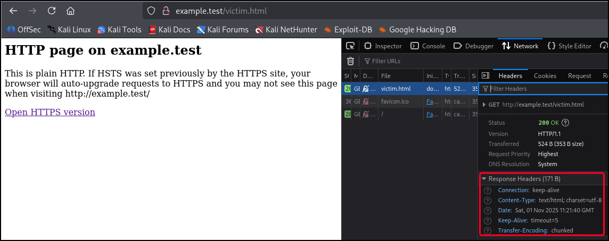
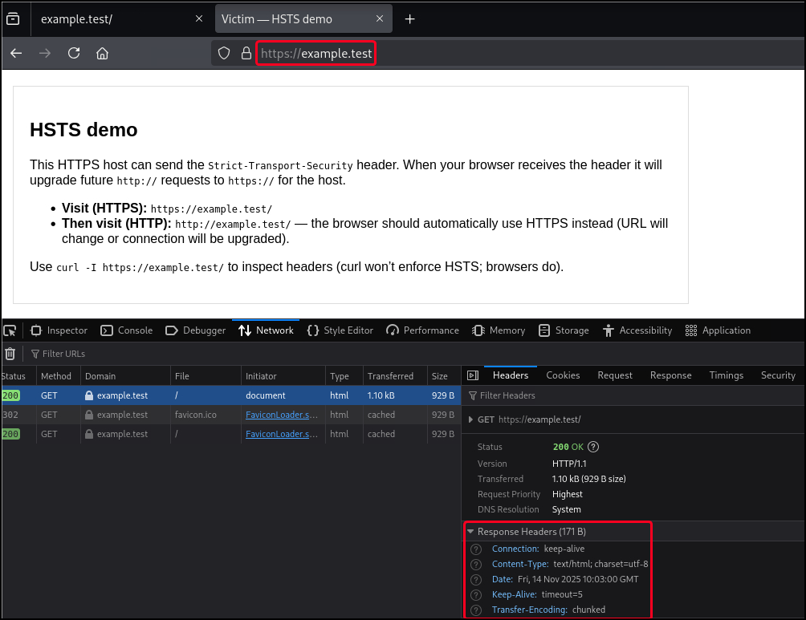
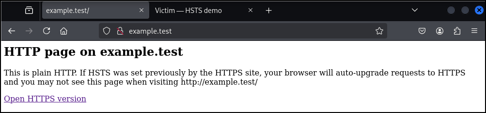
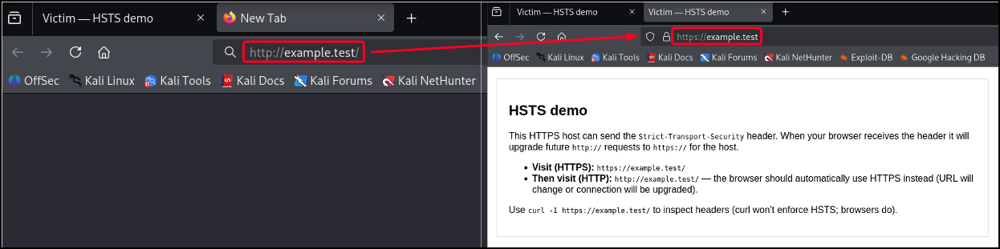
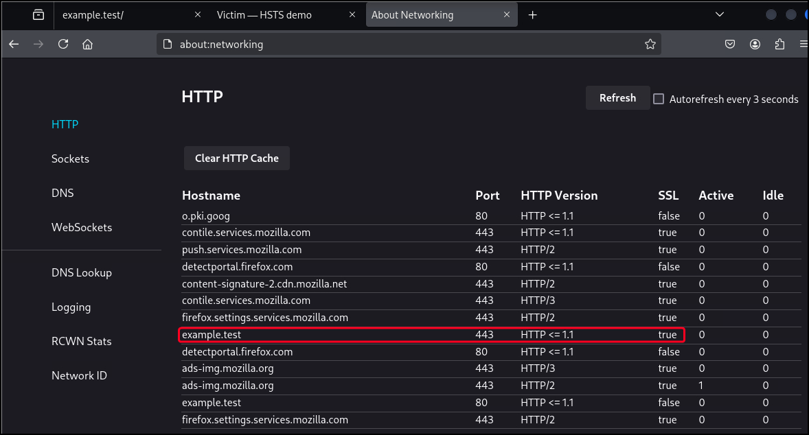
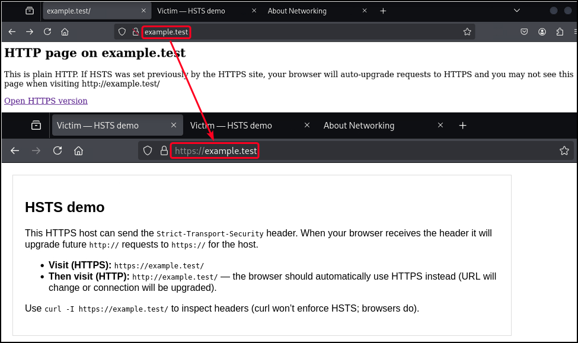

# Purpose

`Strict-Transport-Security` (HSTS) is an HTTP response header that tells browsers: **only access this site over HTTPS for a specified time**. Once a browser receives the header over a secure connection, it will automatically upgrade future `http://` requests for that host to `https://` and will refuse to connect to the site over plain HTTP — preventing downgrade attacks and cookie/session exposure over insecure channels. HSTS is a browser-enforced security control and only takes effect when initially received on a secure (HTTPS) connection.

# Values

| Directive | Meaning |
| --- | --- |
| `max-age=<seconds>` | Required. How long (in seconds) the browser should enforce HTTPS for the host. |
| `includeSubDomains` | Optional. Apply HSTS policy to all subdomains. Use with care. |
| `preload` | Optional. Request site be added to browser preload lists (site will be hardcoded in browsers as HTTPS-only). Read preload requirements before using. |

```bash
# Example header
Strict-Transport-Security: max-age=31536000; includeSubDomains; preload
```

# References

- [Strict-Transport-Security header (MDN)](https://developer.mozilla.org/en-US/docs/Web/HTTP/Reference/Headers/Strict-Transport-Security)
- [HTTP Strict Transport Security Cheat Sheet (OWASP)](https://cheatsheetseries.owasp.org/cheatsheets/HTTP_Strict_Transport_Security_Cheat_Sheet.html)
- [HTTP Strict Transport Security (HSTS)](https://hstspreload.org/)

# PoC

This PoC shows how HSTS is sent and what effect it has on browsers. We will run both an HTTPS server (port 443) and an HTTP server (port 80). Some things to note:
- HSTS **only** applies when received over HTTPS, i.e. the header must be sent on an HTTPS response.
- To see automatic upgrades from `http://` to `https://` we should serve HTTPS on the standard port (443). Using non-standard ports complicates automatic upgrades.

> Note: We will use the hostname `example.test` to avoid issues with `localhost` and certs.

1. Generate a local certificate using `mkcert`:

```bash
# Install mkcert
$ sudo apt install mkcert

# Install certutil
$ sudo apt install libnss3-tools

# Create a local Certificate Authority
$ mkcert -install
The local CA is already installed in the system trust store! 👍
ERROR: no Firefox and/or Chrome/Chromium security databases found

# Create a directory to store the certificate files
$ mkdir cert

# Generate a certificate for the example.test domain
$ mkcert -key-file cert/server.key -cert-file cert/server.crt example.test localhost 127.0.0.1 ::1
Note: the local CA is not installed in the Firefox and/or Chrome/Chromium trust store.
Run "mkcert -install" for certificates to be trusted automatically ⚠️

Created a new certificate valid for the following names 📜
 - "example.test"
 - "localhost"
 - "127.0.0.1"
 - "::1"

The certificate is at "cert/server.crt" and the key at "cert/server.key" ✅

It will expire on 1 February 2028 🗓

# Update the local DNS file
$ grep example.test /etc/hosts
127.0.0.1       localhost example.test
::1     ip6-localhost ip6-loopback example.test
```

2. Run the server without HSTS set, confirm that it’s not there, and visit HTTP (port 80) and HTTPS (port 443). Note that we can jump again to the former after we have visited the latter:

```bash
$ HSTS=0 node server.js
HTTPS server running: https://example.test:443/victim.html
HSTS is DISABLED
HTTP server running: http://example.test:80/victim.html

$ curl -I https://example.test
HTTP/1.1 200 OK
Content-Type: text/html; charset=utf-8
Date: Fri, 14 Nov 2025 09:49:46 GMT
Connection: keep-alive
Keep-Alive: timeout=5
```







3. Run the server with HSTS, confirm that it's there:

```bash
$ HSTS=1 node server.js
HTTPS server running: https://example.test:443/victim.html
HSTS is ENABLED -> max-age=31536000; includeSubDomains; preload
HTTP server running: http://example.test:80/victim.html

$ curl -I https://example.test
HTTP/1.1 200 OK
Strict-Transport-Security: max-age=31536000; includeSubDomains; preload
Content-Type: text/html; charset=utf-8
Date: Fri, 14 Nov 2025 10:05:03 GMT
Connection: keep-alive
Keep-Alive: timeout=5
```



4. After visiting the `https://` protocol, the certificate would be stored in the browser:



5. Now, we won't be able to visit the HTTP port; the browser will automatically rewrite HTTP to HTTPS before the request leaves:

