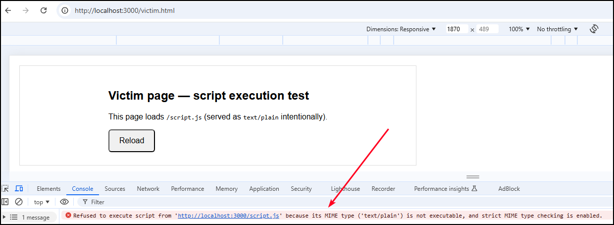

# Purpose

The `X-Content-Type-Options` is an HTTP response header that tells browsers to **stop MIME sniffing** and to trust the `Content-Type` header the server sends. MIME sniffing is when a browser inspects a resource’s actual bytes (its content) instead of relying solely on the server’s `Content-Type` header, then heuristically decides a more “likely” MIME type to use — for example treating a `text/plain` response that contains JavaScript-like text as `application/javascript`. That behavior was originally intended to improve compatibility with misconfigured servers, but it can be dangerous: an attacker who can make the site return attacker-controlled content (or exploit a mislabelled upload/endpoint) may trick the browser into executing script or styles, enabling XSS or other client-side attacks. The simple mitigation is to ensure correct `Content-Type` values and send `X-Content-Type-Options: nosniff`, which tells browsers to trust the declared type and not perform sniffing. This prevents browsers from guessing a resource’s type, therefore, reducing the risk that a resource with an incorrect or attacker-controlled MIME type will be interpreted and executed in a way that enables XSS or other attacks.

# Values

| Value | Behavior |
| --- | --- |
| `nosniff` | Instructs the browser **not** to MIME-sniff; the browser should strictly follow the `Content-Type` header and refuse to interpret content as a different type. |

# References

- [X-Content-Type-Options (MDN)](https://developer.mozilla.org/en-US/docs/Web/HTTP/Reference/Headers/X-Content-Type-Options)
- [HTTP Security Response Headers CheatSheet (OWASP)](https://cheatsheetseries.owasp.org/cheatsheets/HTTP_Headers_Cheat_Sheet.html#x-content-type-options)
- [MIME Sniffing in Browsers and the Security Implications (Coalfire)](https://coalfire.com/the-coalfire-blog/mime-sniffing-in-browsers-and-the-security?utm_source=chatgpt.com)

# PoC

The goal of this PoC is to show the difference between no header and `X-Content-Type-Options: nosniff` by serving a JavaScript file with an incorrect `Content-Type` and observing whether the browser executes it. Serve `script.js` as JavaScript content but intentionally set the `Content-Type: text/plain` so there is a mismatch:

```bash
$ node server.js
```

Confirm that the header is not set:

```bash
$ curl -I http://localhost:3000/script.js
HTTP/1.1 200 OK
Content-Type: text/plain; charset=utf-8
Date: Tue, 28 Oct 2025 16:53:36 GMT
Connection: keep-alive
Keep-Alive: timeout=5
```
Visiting the page on the browser the `script.js` file will be successfully loaded and executed:


    
Next, start the server with the header set and confirm its presence:

```bash
# Restart the server with the target header present
$ NOSNIFF=1 node server.js

# Confirm that the target header is now set
$ curl -I http://localhost:3000/script.js
HTTP/1.1 200 OK
X-Content-Type-Options: nosniff
Content-Type: text/plain; charset=utf-8
Date: Tue, 28 Oct 2025 16:59:18 GMT
Connection: keep-alive
Keep-Alive: timeout=5
```

Now the `script.js` file will be blocked:


