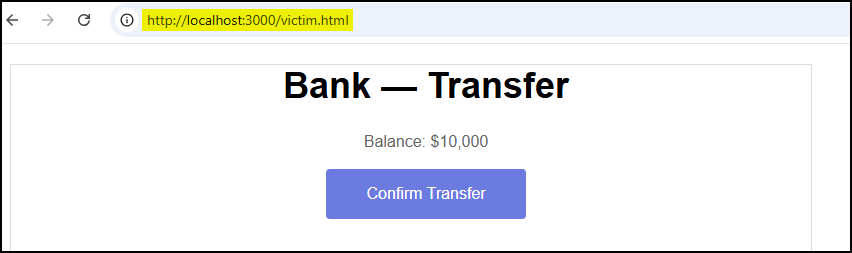
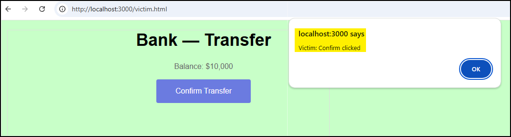
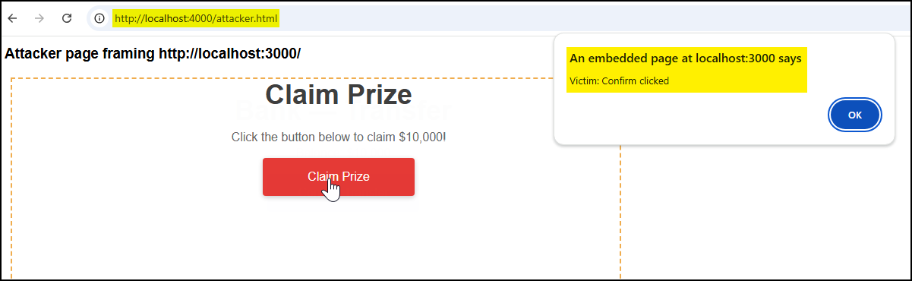
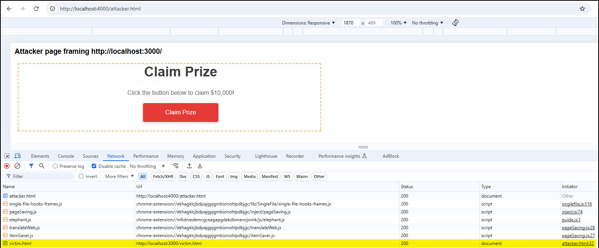
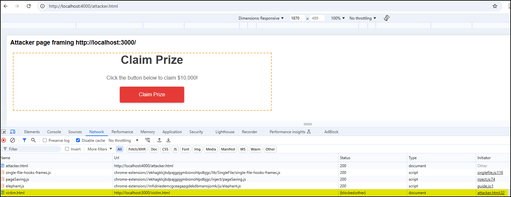
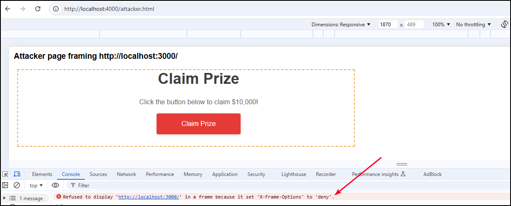

# Purpose

`X-Frame-Options` is an HTTP response header that instructs the browser whether the page is allowed to be framed (inside `<frame>`, `<iframe>`, `<object>`, `<embed>`). It’s used primarily to mitigate **clickjacking** — where an attacker embeds your page inside a malicious page and tricks users into clicking hidden buttons or inputs. 

Modern best practice is to prefer the CSP `frame-ancestors` directive because it’s more flexible and replaces `X-Frame-Options` in supporting browsers; however `X-Frame-Options` is still widely supported and still useful as a compatibility measure.

# Values

> CSP `frame-ancestors` is more expressive (you can list multiple origins and use `'none'`, `'self'`, or specific schemes/hosts). Browsers will prefer `frame-ancestors` when present; `X-Frame-Options` remains useful for older browsers that don't support CSP.

| Values | Description |
| --- | --- |
| `DENY` | Page **must not** be displayed in a frame, regardless of origin (strongest protection). |
| `SAMEORIGIN` | Page may be framed only by pages from the same origin (use if same-site framing is legitimate). |
| `ALLOW-FROM <URI>` | Attempted to allow a specific origin to frame the page; **deprecated / poorly supported** (do not rely on it). Use CSP’s `frame-ancestors` instead. |

# References

- [OWASP HTTP Headers Cheat Sheet: X-Frame-Options](https://cheatsheetseries.owasp.org/cheatsheets/HTTP_Headers_Cheat_Sheet.html#x-frame-options)
- [MDN X-Frame-Options Header](https://developer.mozilla.org/en-US/docs/Web/HTTP/Reference/Headers/X-Frame-Options)
- [Content-Security-Policy: frame-ancestors directive](https://developer.mozilla.org/en-US/docs/Web/HTTP/Reference/Headers/Content-Security-Policy/frame-ancestors)
- [OWASP Clickjacking Defense Cheat Sheet](https://cheatsheetseries.owasp.org/cheatsheets/Clickjacking_Defense_Cheat_Sheet.html)

# PoC

We’ll demonstrate clickjacking by hosting a simple **victim** page and a separate **attacker** page. The latter visually mimics the victim and overlays an almost‑invisible iframe to capture clicks. First we’ll show the vulnerability by loading the attacker page and using the browse to prove the victim is framed and no frame‑protection header is present. Then we’ll add frame protection on the victim, restart the victim server, and repeat the checks to show the header is sent and the browser refuses to render the frame, preventing the clickjacking.

1. Serve each file on a different port:

```bash
┌──(x7331㉿CSpanias)-[~/security_headers/x-frame-options/victim]
└─$ sudo python3 -m http.server 3000
[sudo] password for x7331:
Serving HTTP on 0.0.0.0 port 3000 (http://0.0.0.0:3000/) ...
```

```bash
┌──(x7331㉿CSpanias)-[~/security_headers/x-frame-options/attacker]
└─$ sudo python3 -m http.server 4000
Serving HTTP on 0.0.0.0 port 4000 (http://0.0.0.0:4000/) ...
```

1. Confirm the the `X-Frame-Options` header is not set:

```bash
$ curl -I http://localhost:3000/victim.html
HTTP/1.0 200 OK
Server: SimpleHTTP/0.6 Python/3.13.7
Date: Tue, 28 Oct 2025 11:58:54 GMT
Content-type: text/html
Content-Length: 1080
Last-Modified: Tue, 28 Oct 2025 11:14:25 GMT
```

1. Open `victim.html` in your browser and click the *Confirm Transfer* button:





1. Open the `attack.html` in your browser and click the *Claim Prize* button. Since everything is local and no framing protection exists, the click will submit the form inside the framed victim page and you’ll see the pop up demonstrating clickjacking. This can be also confirmed by the HTTP response:





1. Now add protection to the app — create `server.js` within the `victim` directory:
- `server.js`
    
    ```jsx
    const express = require('express');
    const path = require('path');
    
    const app = express();
    const PORT = process.env.PORT || 3000;
    
    // Add frame protection BEFORE static middleware
    app.use((req, res, next) => {
      // Choose one:
      res.setHeader('X-Frame-Options', 'DENY');        // strictest: block all framing
      // res.setHeader('X-Frame-Options', 'SAMEORIGIN');   // allow only same-origin frames
      // Alternative modern CSP (not used here): 
      // res.setHeader('Content-Security-Policy', "frame-ancestors 'self'");
      next();
    });
    
    // Then serve static files (victim.html etc.)
    app.use(express.static(path.join(__dirname)));
    
    app.listen(PORT, () => {
      console.log(`Victim server running: http://localhost:${PORT}/victim.html`);
    });
    ```
    
1. Stop the Python HTTP server running on port `3000` and start the node server:

```jsx
$ npm init -y && npm install express
$ node server.js
Victim server: http://localhost:3000/victim.html
```

1. Confirm that the `X-Frame-Options` header is set and try loading the `attacker.html` page again:

```bash
$ curl -I http://localhost:3000/victim.html
HTTP/1.1 200 OK
X-Powered-By: Express
X-Frame-Options: DENY
Accept-Ranges: bytes
Cache-Control: public, max-age=0
Last-Modified: Tue, 28 Oct 2025 11:14:25 GMT
ETag: W/"438-19a2a86c11a"
Content-Type: text/html; charset=utf-8
Content-Length: 1080
Date: Tue, 28 Oct 2025 11:44:33 GMT
Connection: keep-alive
Keep-Alive: timeout=5
```



