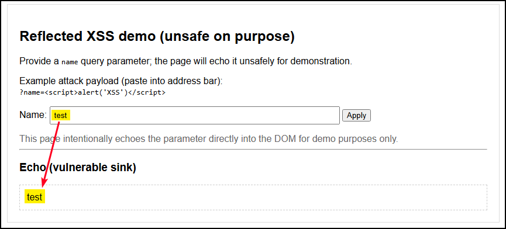
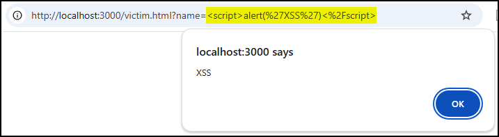
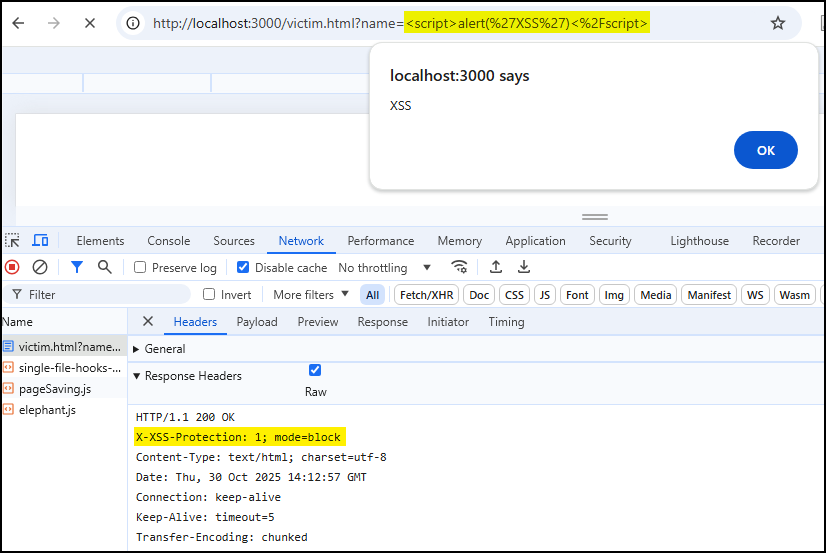

# Purpose

`X-XSS-Protection` is an HTTP response header originally implemented by some browsers as a **legacy, heuristic XSS filter**. When enabled, these browsers attempted to detect reflective XSS payloads in the rendered page and either sanitized or blocked the page rather than executing the injected script. It was historically useful as an extra stopgap on older browsers that lacked strong built‑in XSS protections, but **the behavior was browser‑specific and occasionally caused benign pages to break**. 

Modern browsers have largely removed or deprecated this header in favour of secure coding, proper output encoding, and `Content-Security-Policy` (CSP).

# Values

| Value | Description |
| --- | --- |
| `0` | Disable the XSS auditor. |
| `1` or `1; mode=block` | Enable the XSS auditor. `1; mode=block` instructs the browser to block rendering the page when an XSS attack is detected; `1` alone may attempt to sanitize. |
| `1; report=<uri>` | Deprecated/unsupported in most browsers — attempt to report detections to `<uri>` (rarely implemented) |

# References

- [HTTP Security Response Headers Cheat Sheet](https://cheatsheetseries.owasp.org/cheatsheets/HTTP_Headers_Cheat_Sheet.html#x-xss-protection)
- [MDN — X-XSS-Protection header](https://developer.mozilla.org/en-US/docs/Web/HTTP/Reference/Headers/X-XSS-Protection)
- [Defenses against XSS](https://developer.mozilla.org/en-US/docs/Web/Security/Attacks/XSS#defenses_against_xss)

# PoC

This PoC demonstrates a classic reflected XSS and shows how the old `X-XSS-Protection` header is ignored by modern browsers.
    
1. Start the server and confirm that the header is not set:

```bash
$ node server.js
Server listening at http://localhost:3000/victim.html
X-XSS-Protection header is DISABLED/ABSENT

$ curl -I 'http://localhost:3000/victim.html'
HTTP/1.1 200 OK
Content-Type: text/html; charset=utf-8
Date: Thu, 30 Oct 2025 12:58:32 GMT
Connection: keep-alive
Keep-Alive: timeout=5
```

2. If we now pass an XSS payload into the `name` parameter it should execute:





3. Add the `X-XSS-Protection` header, confirm that it is set, and try again. In modern browsers this header would be ignored and, thus, the XSS will still be executed:

```bash
$ XXSP=1 node server.js
Server listening at http://localhost:3000/victim.html
X-XSS-Protection header is ENABLED (1; mode=block)

$ curl -I http://localhost:3000/victim.html
HTTP/1.1 200 OK
X-XSS-Protection: 1; mode=block
Content-Type: text/html; charset=utf-8
Date: Thu, 30 Oct 2025 14:11:16 GMT
Connection: keep-alive
Keep-Alive: timeout=5
```

